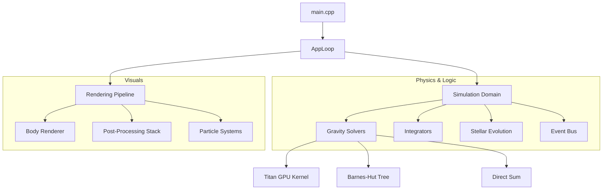

# simSUS — Advanced N-Body Gravitational Engine (C++)


A high-performance, precision-focused gravitational simulation engine built with **C++17** and **Modern OpenGL**. `simSUS` (Simulated Solar Universal System) is a comprehensive physics laboratory designed to simulate everything from sub-kilometer asteroids to supermassive black holes across millions of simulated years.

---

## 🏗 System Architecture

The project follows a decoupled, data-oriented architecture to maximize cache efficiency and modularity:



### Key Modules:
- **`domain/`**: Minimalist data types. `Body.h` is the "Single Source of Truth" for physical state.
- **`physics/`**: Stateless algorithmic kernels for force calculation and numerical integration.
- **`render/`**: A tiered rendering system that switches between batched geometry for dots and complex multi-pass shaders for high-mass bodies.

---

## 🚀 The Titan Core (Physics Engine)

### 1. Hybrid Solver Strategy
`simSUS` utilizes a sophisticated multi-stage physics pipeline:
- **GPU Titan Kernel**: An O(N²) parallel solver optimized for high-throughput. It uses **Shared Memory Tiling**, loading blocks of body data into local caches to minimize global memory access. This allows for real-time 60FPS simulation of **10,000+ bodies**.
- **Barnes-Hut Tree**: A spatial partitioning algorithm ($O(N \log N)$) that approximates distant gravitational forces into "center-of-mass" point sources, dramatically reducing complexity for large, sparse systems.

### 2. Numerical Integration Suite
Selectable integrators allow users to balance speed vs. long-term stability:
- **RK4 (Runge-Kutta 4th Order)**: The gold standard for precision. Re-evaluates forces four times per sub-step.
- **Velocity Verlet**: A symplectic integrator that perfectly preserves energy ($E_{drift} \approx 0$) in periodic systems, ideal for long-term orbital stability.
- **Symplectic Euler**: A fast, stable first-order solver for large-scale dust simulations.

---

## 🌌 Advanced Mathematical Foundation

### 1. Relativistic Light Bending (Gravitational Lensing)
The `lensing.frag` shader implements the Schwarzschild metric approximation to warp light paths:
$$ \alpha = \frac{4GM}{c^2r} $$
Where $\alpha$ is the deflection angle. This creates the characteristic Einstein Rings and light-warping effects seen near Black Holes and Neutron Stars.

### 2. Time Dilation Logic
`simSUS` calculates proper time ($\tau$) for bodies in deep gravity wells:
$$ dt' = dt \sqrt{1 - \frac{R_s}{r}} $$
Where $R_s$ is the Schwarzschild radius $2GM/c^2$. This ensures that "Interstellar-style" time slips occur dynamically as bodies orbit singularities.

---

## 🎨 High-Fidelity Cinematic Rendering

The rendering pipeline is a modern, deferred-style stack:

- **Pass 1: Geometry & FBM**: Renders procedural stellar surfaces. Stars use **Fractal Brownian Motion** noise to simulate a "boiling" surface with limb darkening.
- **Pass 2: Accretion Physics**: Singularities render accretion disks with **Relativistic Beaming**, where the side of the disk moving toward the viewer is artificially brightened via Doppler shifting.
- **Pass 3: Cinematic Post-Processing**:
  - **Thresholding**: Isolate the brightest light sources (Sun/Black Holes).
  - **Dual-Pass Blur**: Horizontal and Vertical Gaussian Blurs create a soft, cinematic glow.
  - **Additive Blending**: Composites the "Bloom" back onto the scene for a high-dynamic-range feel.

---

## 🧬 Stellar Lifecycle & Thermodynamics

`simSUS` treats celestial bodies as living entities. Each body tracks:
- **Composition**: Detailed fractions of Hydrogen, Helium, Carbon, Oxygen, and Iron.
- **Energy Balance**:
  - **Heating**: Gravitational contraction and fusion.
  - **Cooling**: Black-body radiation ($P = \sigma AT^4$).
- **Lifecycle Transitions**: 
  - **Fusion Ignition**: Protostars ignite at critical pressure thresholds.
  - **Red Giant Phase**: Helium shell burning causes massive radius expansion.
  - **Supernova/Collapse**: If mass exceeds the Chandrasekhar or Tolman-Oppenheimer-Volkoff limits, the star collapses into a **White Dwarf**, **Neutron Star**, or **Black Hole**.

---

## 🪐 Comprehensive Preset Gallery

- **Solar System (Default)**: Mercury through Neptune with accurate mass/distance ratios.
- **Binary System**: Two stars in a high-speed stable dance.
- **Galaxy Megascale**: 10,001 particles forming a rotating spiral arm spanning 30,000+ AU.
- **Chaotic Nebula**: A high-density gas cloud collapsing into multiple star systems.
- **Black Hole Collision**: A test of relativistic lensing and mass absorption.

---

## 🗺 Roadmap

- [ ] **Phase 35**: 3D Space & Volumetric Rendering.
- [ ] **Phase 40**: SPH (Smoothed Particle Hydrodynamics) for gas-fluid interactions.
- [ ] **Phase 45**: N-Body Multiplayer / Remote State Synchronisation.
- [ ] **Phase 50**: Procedural Terrain generation for rocky planet "landings".

---

## 🛠 Developer Guide

### Build Requirements:
- **C++ Compiler**: MSVC (VS 2019/2022) or GCC 9+.
- **Graphics**: OpenGL 4.3 Support (for Compute Shaders).
- **Libraries**: SFML 2.5+, nlohmann-json.

### Unit Testing:
```bash
simSUS.exe --test
```
Verifies math kernels, integrator drift, and JSON serialization integrity.

---
Developed by [patchyevolve](https://github.com/patchyevolve)
